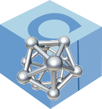

  

## The C++ REST SDK is a Microsoft project for cloud-based client-server communication in native code using a modern asynchronous C++ API design. This project aims to help C++ developers connect to and interact with services.

[Conan.io](https://conan.io) package for [cpprestsdk](https://github.com/Microsoft/cpprestsdk) project

The packages generated with this **conanfile** can be found in [Bintray](https://bintray.com/uilianries/conan/cpprestsdk%3Auilianries).

## Build packages

Download conan client from [Conan.io](https://conan.io) and run:

    $ python build.py

If your are in Windows you should run it from a VisualStudio console in order to get "mc.exe" in path.

## Upload packages to server

    $ conan upload cpprestsdk/2.9.1@uilianries/stable --all

## Reuse the packages

### Basic setup

    $ conan install cpprestsdk/2.9.1@uilianries/stable

### Project setup

If you handle multiple dependencies in your project is better to add a *conanfile.txt*

    [requires]
    cpprestsdk/2.9.1@uilianries/stable

    [options]
    cpprestsdk:shared=True # False

    [generators]
    txt
    cmake

Complete the installation of requirements for your project running:</small>

    conan install .

Project setup installs the library (and all his dependencies) and generates the files *conanbuildinfo.txt* and *conanbuildinfo.cmake* with all the paths and variables that you need to link with your dependencies.

### License
[MIT](LICENSE)
